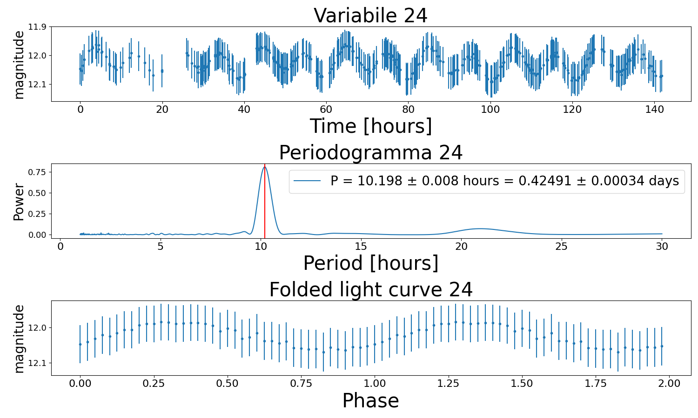

# period_analysis
 Period Analysis of Variable Stars observed by TESS satellite
In this project we Analyze the period of variable stars using a file type lc0000.data extracted by the observation made by the TESS satellite using the Python programming language.
We create a plot of the light curve, the periodogram and the folded light curve, that is the light curve adpted at the most plausible period calculated in this project.

